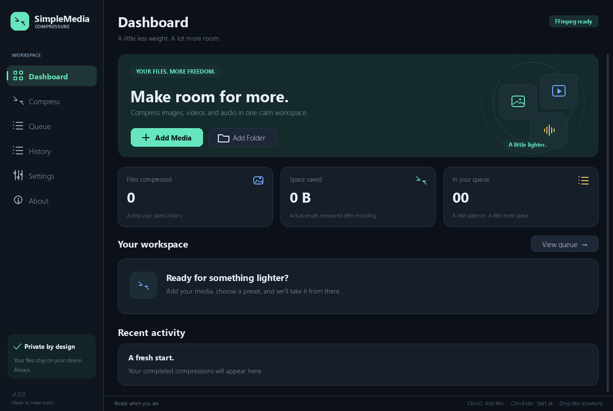
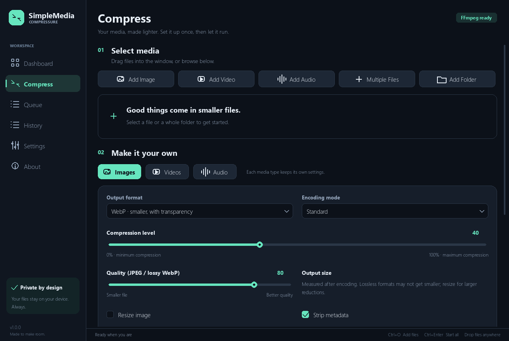

# SimpleMediaCompressure

**Less space. More possibilities.**

A local Python desktop application for compressing images, videos and audio. Built with Pygame CE, Pillow and FFmpeg, with a dark interface, background processing, a controllable queue, and a persistent compression history.



## Features

- Six pages: Dashboard, Compress, Queue, History, Settings and About.
- Native file/folder pickers and file/folder drag and drop.
- Mixed media queues with independent image, video and audio settings.
- Recursive folder scanning, folder structure preservation, and generated-file skipping.
- Isolated encoder processes; the interface stays responsive during encoding and scanning.
- Start, pause, resume, cancel, retry and remove individual jobs, plus queue-wide controls.
- One to four simultaneous jobs; the default is two.
- Actual before/after sizes, savings, progress, estimated remaining time when available, and image previews.
- SQLite history, remembered settings, rotating logs and in-app completion notifications.
- Protected original files, collision-safe output names and temporary output cleanup.
- Keyboard navigation, tooltips, editable paths and a resizable window.
- No account, telemetry or internet connection required for compression.

## Windows release

Open `release/1.0.0beta/` and double-click **SimpleMediaCompressure.exe**. This Windows 10/11 x64 release includes Python, the application libraries, FFmpeg and FFprobe in a single executable. No separate installation or internet connection is needed for compression.

Startup takes a little longer while the included tools unpack into the temporary folder; allow roughly 600 MB of free temporary space. Release documentation and third-party licenses accompany the EXE. Keep these notices when sharing the release.

The instructions below describe running and building from source.

## Source requirements

- **Python 3.11 or newer**. Windows uses native OS file dialogs; macOS/Linux use Tkinter. Development and local testing use Python 3.12 on Windows.
- A desktop display (minimum window size: 980 × 700).
- **FFmpeg** for video and audio. Images work without it.
- **FFprobe**, normally supplied with FFmpeg, for duration-based progress and media inspection.

The runtime dependencies are pinned in [requirements.txt](requirements.txt). Install `pygame-ce`, not a second, overlapping `pygame` distribution in the same environment.

## Installation

Download or clone the repository, then open a terminal in its folder.

### Windows

```powershell
py -3.12 -m venv .venv
.\.venv\Scripts\python.exe -m pip install -r requirements.txt
.\.venv\Scripts\python.exe main.py
```

If using another supported Python version, replace `py -3.12` with that interpreter. After setup, double-click **Launch SimpleMediaCompressure.cmd** to launch without a console window.

### macOS / Linux

```sh
python3 -m venv .venv
.venv/bin/python -m pip install -r requirements.txt
.venv/bin/python main.py
```

Linux distributions may package Tkinter and virtual environments separately, for example `python3-tk` and `python3-venv` on Debian/Ubuntu. On macOS, use a Python installation that includes working Tk support. Drag and drop remains available if Tkinter is missing.

Alternatively, `python -m pip install .` installs the `simplemediacompressure` launcher in your active environment. Launch with `python -m simplemedia` or pass file paths to `main.py` to stage media on startup.

## FFmpeg setup

Use the [official FFmpeg download page](https://ffmpeg.org/download.html) to find installation options for your operating system. For example:

```powershell
# Windows with WinGet
winget install --id Gyan.FFmpeg -e
```

```sh
# macOS with Homebrew
brew install ffmpeg

# Debian / Ubuntu
sudo apt install ffmpeg
```

Restart your terminal after changing PATH. The app checks PATH, and also recognizes standard Gyan FFmpeg WinGet installations on Windows. In **Settings → FFmpeg**, choose **Detect FFmpeg** or **Select executable** to locate `ffmpeg.exe` / `ffmpeg` manually. The adjacent `ffprobe` executable is detected automatically.

The source repository and default development bundle use an external FFmpeg installation. The self-contained Windows release includes FFmpeg and FFprobe and detects them automatically. Encoder availability depends on the selected FFmpeg build. A GPU encoder listed by FFmpeg also needs compatible hardware and drivers; select **Hardware: Off** if it fails.

## Supported formats

| Media | Input | Output |
| --- | --- | --- |
| Images | PNG, JPG/JPEG, WebP, BMP, TIFF, GIF | WebP, JPEG, PNG, TIFF, GIF, BMP |
| Video | MP4, MKV, AVI, MOV, WebM, FLV, M4V | MP4, MKV, MOV, WebM |
| Audio | MP3, WAV, FLAC, AAC, OGG, M4A, Opus | MP3, M4A, AAC, OGG, Opus, FLAC, WAV |

Video/audio decoding and encoding depend on FFmpeg support. A recognized extension does not guarantee that a file is valid. Invalid files fail individually, with a readable error and a retry option.

## How to use

1. Choose **Add Media**, drag files into the window, or open **Compress** and select an input type.
2. For bulk work, use **Add Folder**. Set the bulk options before scanning, then choose the folder again if you change scan options. Scanning runs in the background and can be cancelled.
3. Adjust the **Images**, **Videos** and **Audio** tabs. A mixed selection uses each type's own settings.
4. Choose an output folder, or enable **Use source folder**. **Create “Compressed” folder** adds a subfolder to the chosen location.
5. Choose **Add files to queue**. Settings are copied into each job; later changes affect newly added jobs.
6. Open **Queue** and choose **Start all**, or enable automatic starting in Settings.
7. Click **Details** for a file's paths, settings, warnings, technical errors and before/after results. Click a displayed path to copy it; click the settings summary to copy all encoder settings as JSON.

Generated filenames use `_compressed`, then `_compressed_1`, and so on. **Overwrite existing output files** only replaces generated output names and requires confirmation when adding jobs. The source file is always protected, including when overwrite is enabled.

**Pause** suspends the worker and its encoder process tree. It keeps that job's memory and concurrency slot reserved. **Resume** continues from the same point. **Cancel** terminates that process tree and removes its partial output. Retrying begins from the start.

On normal exit, unfinished jobs are saved and restored in a stopped state. Choose Start to run them again. A forced OS/process termination can leave `.smc-*` temporary files; those are never treated as source inputs by bulk scanning.

### Keyboard shortcuts

| Shortcut | Action |
| --- | --- |
| Ctrl+O | Add files |
| Ctrl+Shift+O | Add folder |
| Ctrl+Enter | Start / resume all |
| Ctrl+1 … Ctrl+6 | Switch pages |
| Tab / Shift+Tab | Move through visible controls |
| Enter / Space | Activate a focused button |
| Up / Down, Enter | Choose an open dropdown option |
| Escape | Close a dialog, dropdown or job details |
| Ctrl+A / C / V | Select all / copy / paste in text fields |
| Mouse wheel | Scroll the page or an open dropdown |

## Compression behavior

**Images:** The compression slider changes format-specific encoder settings. JPEG maps it to quality 100–50 and chooses chroma subsampling; PNG maps it to compression effort 0–9; WebP combines quality with effort 0–6. The separate quality slider allows a wider JPEG/lossy WebP range. PNG and TIFF output use lossless encoding, while BMP is uncompressed. Lossless WebP is optional. Resizing and format conversion can still change pixel data even when the encoder is lossless.

EXIF orientation is applied before resizing. Transparent-to-JPEG/BMP conversion is rejected unless **Flatten transparency on white** is enabled. Animation/multiple pages are preserved for GIF, WebP, PNG/APNG and TIFF; conversion to a single-frame format is rejected. GIF uses a limited palette and one-bit transparency. Supported EXIF, ICC, text and comment metadata is retained when requested, but metadata cannot always be transferred between formats.

**Video:** Friendly quality maps to CRF 36–16 for software H.264/H.265, or 48–18 for VP9. Resolution limits height without upscaling and pads odd dimensions for encoder compatibility. Advanced settings expose codec, hardware encoding and audio controls. The first video stream and optional first audio stream are used. Subtitles, attachments, additional tracks and cover art are not copied. This version targets ordinary SDR video; it does not implement HDR tone mapping or a color-managed HDR workflow.

**Audio:** The format selects a compatible codec. Bitrate mode is available for lossy formats; MP3/Vorbis also support variable quality. FLAC is lossless, and WAV uses 16-bit PCM. MP3 quality 0 is best and 9 is smallest; Vorbis runs in the opposite direction. Opus automatically resamples to 48 kHz when Original is selected.

Output can be **larger** than the original, particularly when re-encoding an already optimized file or choosing a lossless format. Savings always use actual file sizes and can be negative. Image progress reports decode/prepare/encode milestones; it is not a continuous per-pixel measurement. Video/audio time estimates depend on FFprobe duration and FFmpeg progress.

For a selected audio file in bitrate mode, a duration-based size estimate appears below the settings. It excludes container overhead. Variable-quality and lossless output are measured after encoding.

Pillow's decompression-bomb protections remain enabled. Image sequences exceeding 512 MB of estimated decoded frame data are rejected with an explanation. Choose fewer simultaneous jobs for large images. Media filenames are passed to encoders as argument-list entries; FFmpeg is limited to local file/pipe protocols.

## History, settings and logs

| Operating system | Application data folder |
| --- | --- |
| Windows | `%LOCALAPPDATA%\SimpleMediaCompressure` |
| macOS | `~/Library/Application Support/SimpleMediaCompressure` |
| Linux | `$XDG_DATA_HOME/SimpleMediaCompressure`, or `~/.local/share/SimpleMediaCompressure` |

The folder contains `settings.json`, `library.sqlite3`, and rotating `logs/application.log` files. **Settings → Open data folder** opens it. Set `SMC_DATA_DIR` to use a different location, including an isolated test directory.

History contains filenames, output paths, sizes, timestamps, settings and results. **Clear completed** clears the queue view while keeping history. **Clear history** requires confirmation and removes records and statistics; it never deletes media. Logging normally uses job IDs and error types rather than full media paths. Technical errors can be copied explicitly from job details for debugging.

## Build an executable

Build on the operating system you intend to distribute to:

```sh
python -m pip install -r requirements-dev.txt
python build.py
```

PyInstaller creates a windowed, directory-based application in `dist/SimpleMediaCompressure/`. On Windows, launch `SimpleMediaCompressure.exe` inside that folder. Distribute the **whole folder**, including `_internal`, not only the executable. FFmpeg stays an external dependency. Builds are unsigned unless you sign them separately.

To build the self-contained Windows x64 release instead:

```sh
python build.py --release 1.0.0beta
python tests/verify_build.py --exe release/1.0.0beta/SimpleMediaCompressure.exe --bundled
```

This creates `release/1.0.0beta/SimpleMediaCompressure.exe`, along with launch instructions, license notices, build information and a SHA-256 checksum. FFmpeg and FFprobe must be available on the build machine; they are included in the resulting EXE. Use `--ffmpeg-dir PATH` to select a full Gyan FFmpeg distribution with its upstream `LICENSE` and `README.txt`. The generated `release/` directory is ignored by Git.

The bundled validation runs the EXE alone in an isolated directory with external FFmpeg paths hidden. It checks real image, video and audio outputs, the packaged GUI, and temporary extraction cleanup.

The same executable launches isolated workers through an internal entry point. Worker progress uses local JSON event files so it also works in a windowed executable or under `pythonw`.

Before publishing, edit [simplemedia/metadata.py](simplemedia/metadata.py) to set the author and real repository/release URLs. The version is defined there once. GitHub/update buttons remain disabled until valid project links are configured. **Check for updates** opens the configured releases page; it does not download or install software.

## Development and tests

```sh
python -m pip install -r requirements-dev.txt
python -m pytest -q
python -m ruff check simplemedia tests main.py build.py
python -m ruff format --check simplemedia tests main.py build.py
```

The suite generates its own media and covers transparency, orientation, animation, lossless pixels, corrupted/missing input, filename collisions, bulk discovery, real audio/video conversions, queue concurrency, pause/cancel, restart, persistence and Pygame controls at two window sizes. FFmpeg integration cases skip when FFmpeg/FFprobe or a required encoder is unavailable; review the skip count before claiming full coverage.

For visual QA, run `python main.py --page Compress --size 1280x860 --screenshot docs/compress.png`. It renders the actual application and exits. Set `SDL_VIDEODRIVER=dummy` and `SMC_DATA_DIR` to an isolated path for headless testing.

See [CONTRIBUTING.md](CONTRIBUTING.md) for architecture and contribution guidance, [CHANGELOG.md](CHANGELOG.md) for changes, and [docs/TESTING.md](docs/TESTING.md) for validation details.

## Troubleshooting

- **Missing module:** use the same virtual-environment interpreter for installation and launch. Avoid installing both pygame distributions together.
- **File picker unavailable:** on macOS/Linux, install Tkinter for your Python distribution. Windows uses its built-in common-item dialogs. Drag and drop files as a fallback; output paths are editable directly.
- **FFmpeg not detected:** use Detect FFmpeg or select its executable in Settings. FFmpeg is not necessary for images.
- **Encoder unavailable / hardware error:** use a supported software codec or a full FFmpeg build; GPU support also needs drivers.
- **Permission denied / low disk space:** choose a writable output folder with more free space. Temporary files are written on the destination drive.
- **Transparent or animated input fails:** choose a format that preserves those features, or explicitly flatten transparency for JPEG/BMP.
- **No size reduction:** lower quality, resize, or choose a different format. PNG optimization alone may produce little change.
- **Very large image rejected:** the app keeps Pillow's safety limits and bounds animation memory. Use a specialist tool to reduce oversized sequences before importing.
- **A job failed:** open Details, read the message, and use Copy technical error when reporting it. Other jobs continue.
- **App cannot start:** check the application data folder's permissions and `logs/application.log`. Test in a fresh virtual environment.

## Screenshots

The dashboard screenshot above is from the running application. Additional screenshots can be generated with the visual QA command. They should show actual behavior rather than sample results presented as real completed work.



## License and acknowledgments

SimpleMediaCompressure is available under the [MIT License](LICENSE). Pygame CE, Pillow, psutil, PyInstaller and FFmpeg retain their own licenses. The self-contained release includes third-party license notices in `licenses/` and `THIRD_PARTY_NOTICES.txt`.

Encoder behavior follows the [Pillow format documentation](https://pillow.readthedocs.io/en/stable/handbook/image-file-formats.html), [FFmpeg documentation](https://ffmpeg.org/ffmpeg.html), and [FFmpeg codec documentation](https://ffmpeg.org/ffmpeg-codecs.html).

Windows file selection uses the [Windows common-item dialog API](https://learn.microsoft.com/en-us/windows/win32/shell/common-file-dialog).
